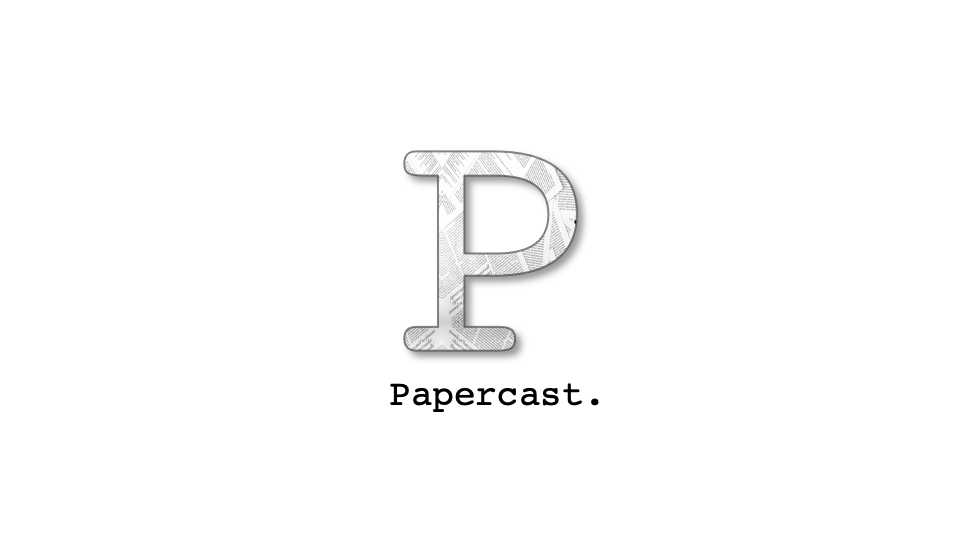

# Papercast

An extensible pipeline tool and plugin ecosystem for processing technical documents. Written in Python.

## Features
Add documents in multiple formats, from popular sources:
- PDF
- TeX/LaTeX
- ArXiv
- Semantic Scholar

Flexible text extraction
- GROBID
- Write your own!

Flexible text narration
- OSX `say` command
- Write your own!

Publish to multiple endpoints:
- Self-hosted RSS podcast using GitHub Pages
- Any other endpoint you can think of

Run anywhere:
- Local machine
- Cloud (AWS, GCP, Azure, etc.)

## More Info
- [Documentation](https://docs.papercast.dev)
